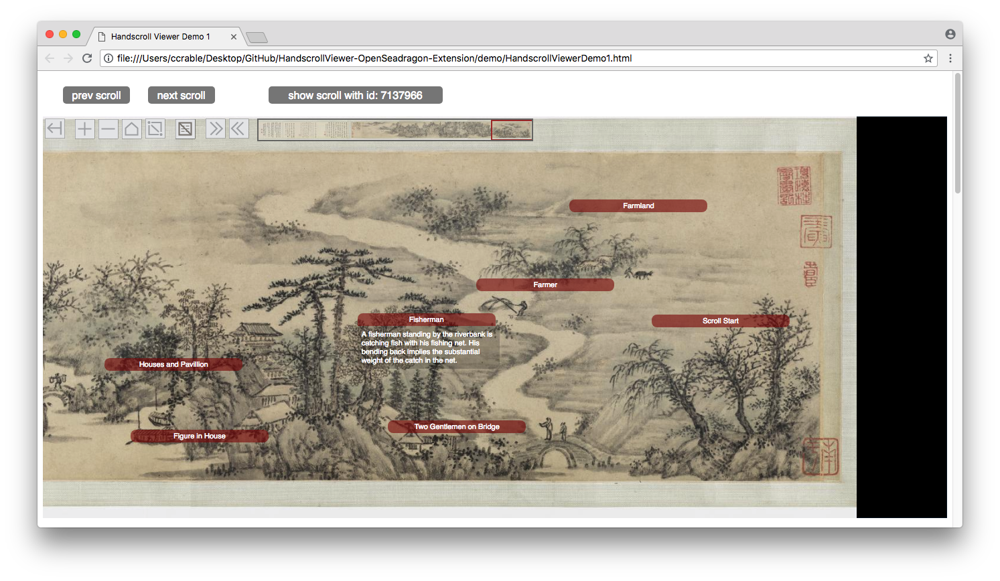
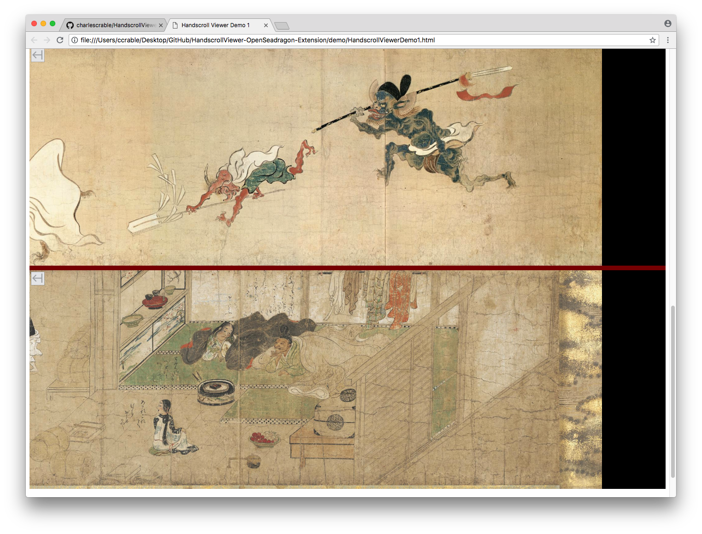
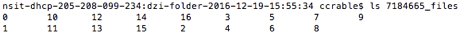
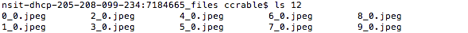

# HandscrollViewer-OpenSeadragon-Extension

The HandscrollViewer-OpenSeadragon-Extension project implements a high level API specifically for viewing Asian handscrolls. The API is implemented in a JavaScript class __HandscrollViewer__ that extends the OpenSeadragon image viewer class.  See <http://openseadragon.github.io/>.

Asian handscrolls are very wide paintings normally viewed from the right edge to left edge as the scroll is unrolled. The major use case for the HandscrollViewer class is pedagogical, and as such special features such as annotations and auto scroll display are included.

<https://scrolls.uchicago.edu> is a popular public website that uses the HandscrollViewer class to display high resolution Asian scroll images.

A __simple demonstration website__ referenced in the following documentation is located at `demo/HandscrollViewerDemo1.html` in this project. Clone or download the project to your local computer.  Open `HandscrollViewerDemo1.html` in your browser. 


# Features of the HandscrollViewer

* Standardized user interface including custom buttons and navigation control

* Optional annotations can be added and controlled for specific images

* Initial display and Home start at the right edge of the image (per handscroll tradition)

* Horizontal auto scroll with custom scroll speed control

* Annotation creation aide is included

* Image and annotation information are specified in separate metadata for ease of updating

* Standard OpenSeadragon functionality (zoom in and out, image drag, full screen mode, etc.) are fully available


### Demo website

A __simple demonstration website__ referenced in the following documentation is located at `demo/HandscrollViewerDemo1.html` in this project's folder'. Clone or download the project to your local computer.  Open `HandscrollViewerDemo1.html` in your browser. 


<sup><sup>Screenshot of a scroll view at the top of the demo site page<sup><sup>


Control buttons and the navigation control are in the upper left corner of the view window. When the mouse moves off the view, the controls fade out of view.

__Custom Control Buttons__ added in addition to standard OpenSeadragon buttons include the following:

 This button hides all the control buttons and the navigation control image even if the mouse is over the scroll image. This feature is especially useful when viewing in full screen mode.

 The home button resets the current view to the right edge of the scroll image. Traditionally handscroll viewing starts at the right edge. In standard OpenSeagragon the home button resets the view to the horizontal center of the image.

  The annotation display can be toggled on and off.

 Auto scroll the scroll image view to the right.  

 Auto scroll the scroll image view to the left.

Note: auto scrolling is useful in teaching or presentation situations.

The __Custom Navigation Control Image__ operates as in a standard OpenSeadragon viewer. What differs here is the height of the navigation control image is fixed at a readable height, and the width varies based on the aspect ratio of the scroll image. This eliminates the problem of the navigation control image being so thin it is unusable.

__Annotations__ are implemented as a title area that when clicked toggles display of the full text of the annotation.

The __prev scroll__, __next scroll__ and __show scroll with id:7137966__ buttons at the top of the page are external to the HandscrollViewer window.  The __prev scroll__ and __next scroll__ buttons open the previous or next scroll image in the current list of scroll image objects.  The __show scroll with id:7137966__ opens the scroll with id 7137966 in the current list of scroll image objects. (See the __DZI Images Metadata Objects Array `siteDziImages`__ section below).  

Below is a screenshot of the bottom of the demonstration website page showing two independent HandscrollViewer windows stacked vertically for comparison purposes:




# HTML Implementation of HandscrollViewer Windows

Refer to the files in the `demo/`directory of this project. 

The following files can be viewed in a text or program editor:

```
HandscrollViewerDemo1.html

HandscrollViewerDemo1DziImages.js

HandscrollViewerDemo1Annotations.js
```

`HandscrollViewerDemo1.html` is the HTML code of the demonstration web page which contains three HandscrollViewer windows.

`HandscrollViewerDemo1DziImages.js` defines the array of image metadata objects which define the scroll images available to the current website.

`HandscrollViewerDemo1Annotations.js` defines the array of annotation metadata objects which define the annotations available for the images in the current website.


The website implementation also depends on the following directories:

```
openseadragon-bin-2.2.1

DZIImages

buttonImages
```

The `openseadragon-bin-2.2.1` directory contains OpenSeadragon JavaScript code and data needed by the HandscrollViewer class.  __Note: this version of OpenSeadragon is the only version tested with HandscrollViewer.__

The `DZIImages` directory contains the DZI image folders of the scroll images available in the demonstation website. See the __DZI Image Notes__ section below.

The `buttonImages` directory contains the custom button images needed by HandscrollViewer.  __Note: the location of the custom button images is specified in the HandscrollViewer public property `prefixScrollUrl`.__


### Including Files and Folders Needed by HandscrollViewer

Below is the HTML code from the demonstration website that includes the JavaScript and data files needed by HandscrollViewer:

```

<!-- include openseadragon js library -->
<script src="./openseadragon-bin-2.2.1/openseadragon.js"></script>

<!-- include handscrollviewer1 js library AFTER openseadragon js library  -->
<script src="./handscrollviewer1.js"></script>

<!-- include js array of DZI image objects for this website  -->
<script src="./HandscrollViewerDemo1DziImages.js"></script>

<!-- include js array of annotation objects for this website  -->
<script src="./HandscrollViewerDemo1Annotations.js"></script>

```


### Defining HTML DIV areas for HandscrollViewer Windows

Three HTML DIV areas for HandscrollViewer windows are defined in the demonstration website page. Each viewer DIV has a unique `id`.

The single viewer DIV at the top of the page is shown below:

```

<!-- handscrollviewer-1-div scroll viewer div -->
<div id="handscrollviewer-1-div">
</div>

```

The two comparison viewer DIVs at the bottom of the demonstration page are shown below:

```

<!-- handscrollviewer-2-div scroll viewer div -->
<div id="handscrollviewer-2-div">
</div>

<!-- vertical separator div -->
<div id="vertical-separator-div">
</div>

<!-- handscrollviewer-3-div scroll viewer div -->
<div id="handscrollviewer-3-div">
</div>

```


### Instantiating the HandscrollViewer Windows

The three HandscrollViewer windows in the demonstration page are instantiated as shown below:


```

<script>
var demoHandscrollViewer1;
var demoHandscrollViewer2;
var demoHandscrollViewer3;

window.onload = function() {

// instantiate the three scroll viewers in the test website,
// last viewer instantiated gets focus

demoHandscrollViewer2 = new HandscrollViewer("7137966", "handscrollviewer-2-div");

demoHandscrollViewer3 = new HandscrollViewer("10000104", "handscrollviewer-3-div");

demoHandscrollViewer1 = new HandscrollViewer("728363", "handscrollviewer-1-div");

// set auto scroll speed to fastest (1.0 slowest, 10.0 fastest, default 2.0) for top viewer
demoHandscrollViewer1.setAutoScrollSpeedSetting(10.0);

.
.
.

```

Three variables are created to reference the three HandscrollViewer objects that will be created.

On the `window.onload` event the three HandscrollViewer windows are created using the HandscrollViewer class constuctor method.

The constructor method takes two parameters: the __scroll image id__ string and the __viewer DIV id__ string.

The __scroll image id__ identifies a DZI image metadata object in the `siteDziImages` array defined in the included HandscrollViewerDemo1DziImages.js file. 

The __viewer DIV id__ indentifies the viewer DIV area in the current page where the viewer should be located.


Note: the `setAutoScrollSpeedSetting(10.0)` method called in the demonstration website resets the auto scroll speed.  The auto scroll speed can be set to any number value between 1 and 10.  1 is the slowest and 10 is the fastest.  The default speed is 2.

Note: the last HandscrollViewer instantiated receives focus.


### DZI Images Metadata Objects Array `siteDziImages`

The HanscrollViewer class requires that an array named `siteDziImages` of DZI image metadata object literals exist.  Each DZI image metadata object literal defines the necessary information about each scroll image that can be displayed in the current website.

In the demonstration website the `siteDziImages` array is defined in the HandscrollViewerDemo1DziImages.js file.  The beginning of the array is shown below:

```
var siteDziImages =    [
//  siteDziImages array of DZI image objects for HandscrollViewerTest1.html site
{
// Views of Huqiu 虎丘圖卷
Id: "728363",                       // scroll id string
Url: "./DZIImages/728363_files/",   // scroll DZI image folder url
Height: "2724",                     // scroll height in pixels
Width: "37098",                     // scroll width in pixels
},
{
// Illustrated Scroll of the Nocturnal Procession of One Hundred Goblins 百鬼夜行絵巻
Id: "7137966",
Url: "./DZIImages/7137966_files/",
Height: "2816",
Width: "63978",
},

.
.
.

```

Each DZI image object contains four properties as describe below:

* `Id` a unique string the identifies the DZI image of a scroll.  Used by HandscrollViewer to specify a unique scroll image to display.

* `Url` a url string that specifies the location of the scroll's DZI image directory. The url can be a relative or an absolute address. 

* `Height` the height in number of pixels of the scroll image. Must be correct for the image to be displayed properly.

* `Width` the width in number of pixels of the scroll image. Must be correct for the image to be displayed properly.


### Annotations Metadata Objets Array `siteAnnotations`

The HanscrollViewer class requires that an array named `siteAnnotations` of annotation metadata object literals exist. Each annotation metadata object literal defines the necessary information to display an annotation for a given scroll. Each scroll image, identified by a scroll image id, that has annotations will have an array of annotation objects. 

The scroll image id in the `siteAnnotations` array should match the correct scroll image id in the `siteDziImages` array.

If a scroll image does not have any annotations, an entry in the `siteAnnotations` array DOES NOT have to exits.  If none of the scroll images in the website have annotations, then `siteAnnotations` should refer to an empty array.

In the demonstration website the `siteAnnotations` array is defined in the HandscrollViewerDemo1Annotations.js file.  The beginning of the array is shown below:

```
var siteAnnotations =   [
{
// Landscape (after Huang Gongwang) 臨大痴山水 annotations

Id: "728345",               // scroll id string
imageAnnotations:           // imageAnnotations array of annotation objects
[
{
x: 0.939098,            // x and y OpenSeadragon viewport coordinates
y: 0.004251,            // of the upper right corner of annotation display
title: "Frontpiece",
text: "At the beginning of the handscroll, a title sheet prefaces the painting. The large characters 'hen gu 恨古' can be translated as 'longing for the past.' The first seal that appears on the far right of the scroll is 'ji tang 霽堂.'"
},
{
x: 0.919804,
y: 0.025577,
title: "Calligrapher Signature",
text: "The smaller characters at the end of the title sheet are the signature of the calligrapher Zhou Eryan 周而衍. The signature is written in a very cursive style, but the name can be deciphered through the calligrapher’s seal on the right. The bottom seal reads donghui 東會."
},

.
.
.

```

Each scroll image with annotations has an `Id` property followed by an array named `imageAnnotations` of annotation object literals.

An annotation object defines a single annotation located on a scroll image.  Each annotation object contains four properties as described below:

* `x` x coordinate in OpenSeadragon viewport coordinates of the upper right hand corner of the annotation.

* `y` y coordinate in OpenSeadragon viewport coordinates of the upper right hand corner of the annotation.

* `title` title of the annotation.

* `text` body text of the annotation.


### Annotation Creation Aide

__Simultaneously pressing the `alt` key and the `control` key, then clicking on a scroll image__ in a HandscrollViewer window will display an alert dialog with the OpenSeadragon viewport coordinates of the click location.  Also a temporary test annotation will be created to verify if the annotation location is acceptable.

When creating an annotation for a scroll, identifying the annotation location in OpenSeadragon viewport coordinates is not readily discernable.

The HandscrollViewer implementation provides this convenient method for obtaining the OpenSeadragon viewport coordiates of a specific point on a scroll image.


### DZI Image Notes

The OpenSeadragon JavaScript class (used by HandscrollViewer class) enables effective interactive viewing of high-resolution 'zoomable' images encoded in the [DZI (Deep Zoom Image) format](https://en.wikipedia.org/wiki/Deep_Zoom).

Normally handscroll images are stored in large high-resolution TIFF format files.

The [VIPS image conversion program](https://jcupitt.github.io/libvips/) can be used to convert the TIFF scroll images to DZI format. Below is an example of a VIPS command in a Mac terminal window that converts a TIFF image to a DZI image:

`$ vips dzsave hugescroll.tif my_dzi_folder`

The DZI encoding of a high-resolution image is a folder that contains level of detail sub-folders with JPEG sub-images.

Below is an example of the contents of a DZI folder named ‘7184665_files’. The DZI folder contains sub-folders with integer number names starting with ‘0’:




The .jpeg files in sub-folder ’12’ are listed below:




# TypeScript Source Code

The __TypeScript source code__ for the HandscrollViewer class is located at `src/handscrollviewer1.ts` in this project's folder.

[TypeScript](https://www.typescriptlang.org/) is a typed superset of JavaScript that compiles to plain JavaScript.

Project development uses the Microsoft Visual Studio Code (https://code.visualstudio.com/) editor which includes language support for TypeScript. The actual TypeScript compiler must be installed separately (<https://code.visualstudio.com/docs/languages/typescript>).

The optional explicit specifiction of types in TypeScript allows the compiler to catch errors rather than have things fail at runtime.

Most important, TypeScript defines a syntax for class creation that is understandable by traditional Object Oriented Developers. 

### TypeDoc Source Code Documentation

The HandscrollViewer source code documentation generated by the [TypeDoc](https://typedoc.org/) documentation generator is located at `doc/` in this project folder.  The HandscrollViewer class documentation is provided as a website at `docs/index.html`.

TypeDoc is an API documentation generator, similar to JSDoc, but for TypeScript projects where it takes advantage of the type annotations and inference in the language to assist in the documentation creation. 

The HandscrollViewer class documentation website includes detailed information on the HandscrollViewer class properties, constructor, and public and private methods.


